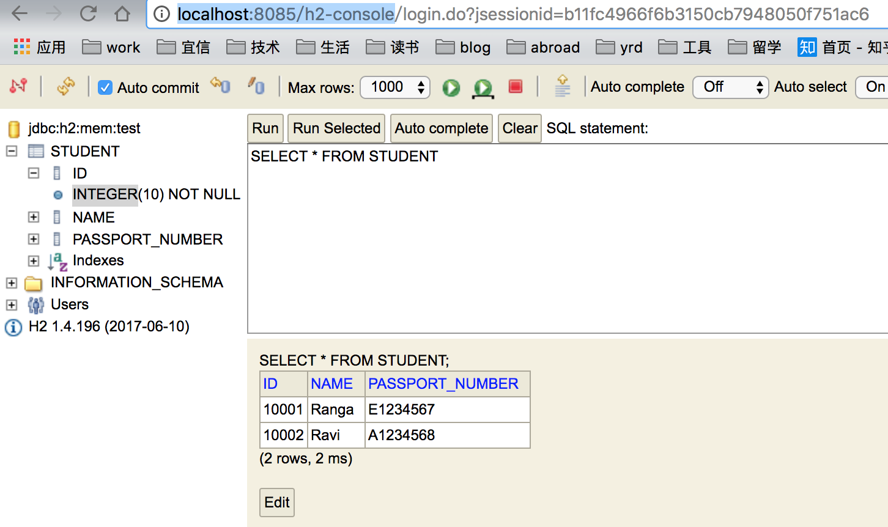

# myapp documentation
In this repo I listed some common codes like unit test, my own utils, etc.

## How to test
Start this web app, visit bellow two urls.
`http://localhost:8085/student?name=hihh&passportNumber=apple`
`http://localhost:8085/students`
## unit test
### mockito
### @Spy

## h2
### h2 console
H2 console could be accessed through `http://localhost:8085/h2-console`. database, tables, initial data could be set 
through schema.sql and data.sql.

## filter and aspect
It's very useful to put some common parameter like ip, userId, uri in the thread locals through a filter.
## trace id
We add a lot of logs through several layers in each request from top to down. In product environment, these logs 
printed in the file and it's impossible to extract all the logs from other requests. So we add an unique request id 
to each request and print this id in each log.
### Define the filter
RequestIdFilter, put the request id in the MDC.
`MDC.put("mdcData", String.format("requestId:%s", UUID.randomUUID().toString().replace("-", "").substring(0, 12)));`
### Add the logback config
`<pattern>%d{HH:mm:ss.SSS} %contextName [%thread] [%X{mdcData}] %-5level %logger{36} - %msg%n</pattern>`
## sonar check with jacoco
### maven plugins

